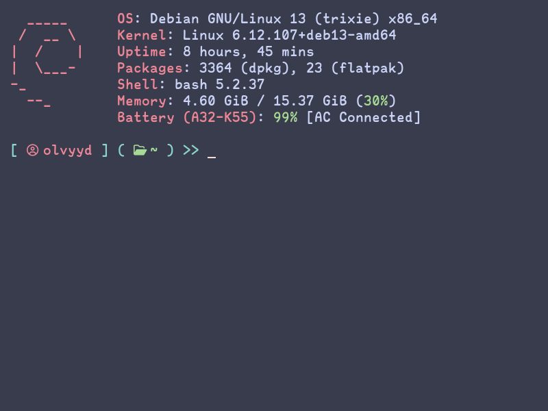

# My Dotfiles
These are my custom configuration files that I use for applications on my systems.

## Configurations:

### bashrc, alacritty & fastfetch


### neovim


## Makefile:
The Makefile contains individual rules for each config if you only want to isntall one of the configs.

## Install script
```bash
#!/bin/bash
# Variables
NAME="$1"
SRC="$2"
TARGET="$3"
# If there is a config file in target.
if [ -d "$TARGET" ] || [ -L "$TARGET" ]; then
    # Format backup path
    BACKUP="${TARGET}_$(date +%Y-%m-%d_%H:%M:%S).backup"

    # Backup the existing config before copying new dotfiles there.
    cp -rf "$TARGET" "$BACKUP"
    echo "WARNING! Found existing config at $TARGET, making backup in $BACKUP"
else
    # Make target directory if there isn't a config.
    mkdir -p "$TARGET"
fi
# Copy dotfiles over to the target.
cp -rf "$SRC/." "$TARGET"
echo "$NAME config installed!"
```

Configurations that are installed in the **config path** of the user use this install script. It makes a backup if it finds an existing configuration at the path, so remember o clean those up if you run these commands a whole bunch of times.