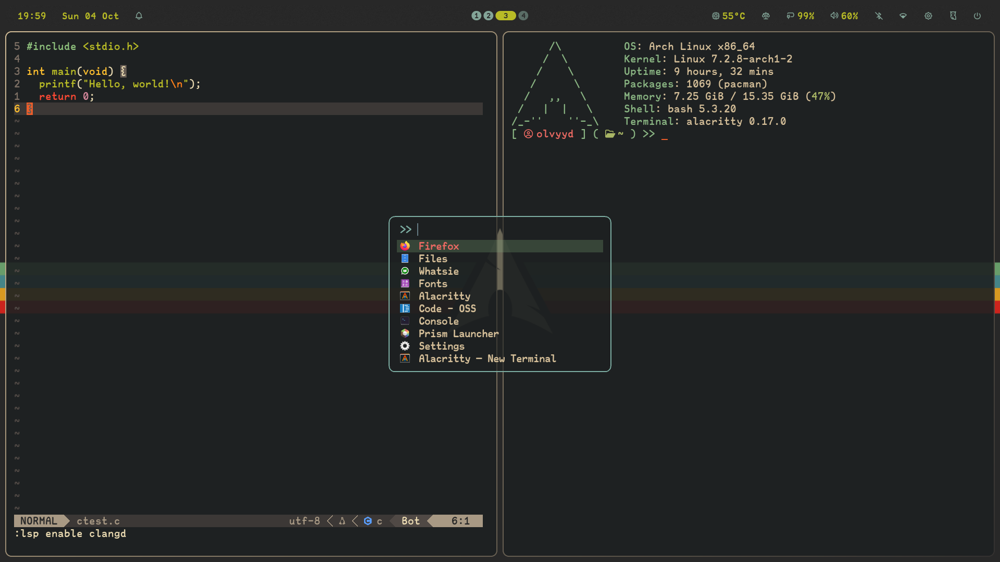

# My dotfiles

These are my dotfiles for some of my favorite software packages.

## How to Install

These files are installed with symlinks using a GNU tool called stow, you can probably find it in your distro's package manager.

```
stow .
```

## Avaliable dotfiles
- Niri
- Fastfetch
- Bash
- Fuzzel
- Neovim
- Noctalia Shell
- Alacritty

## Examples

### Terminals


### Desktop

